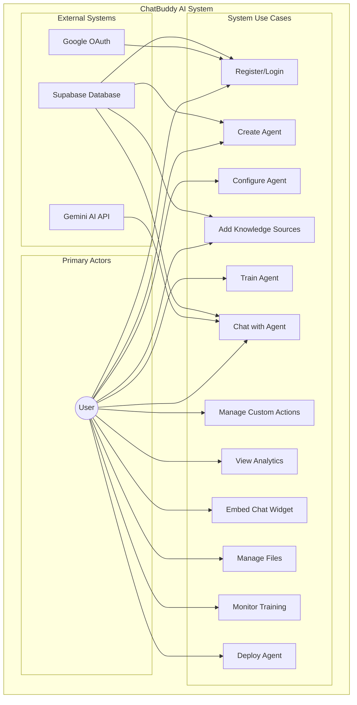
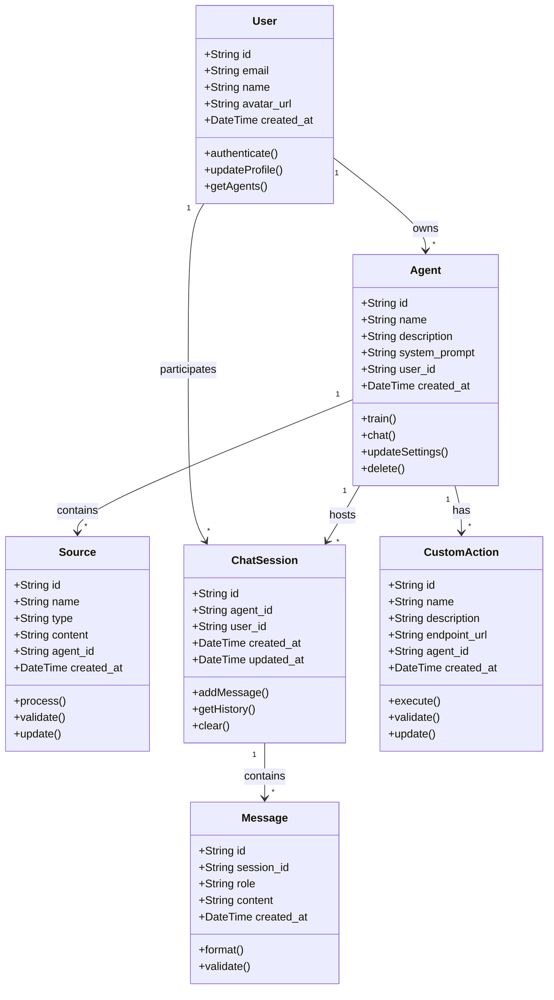
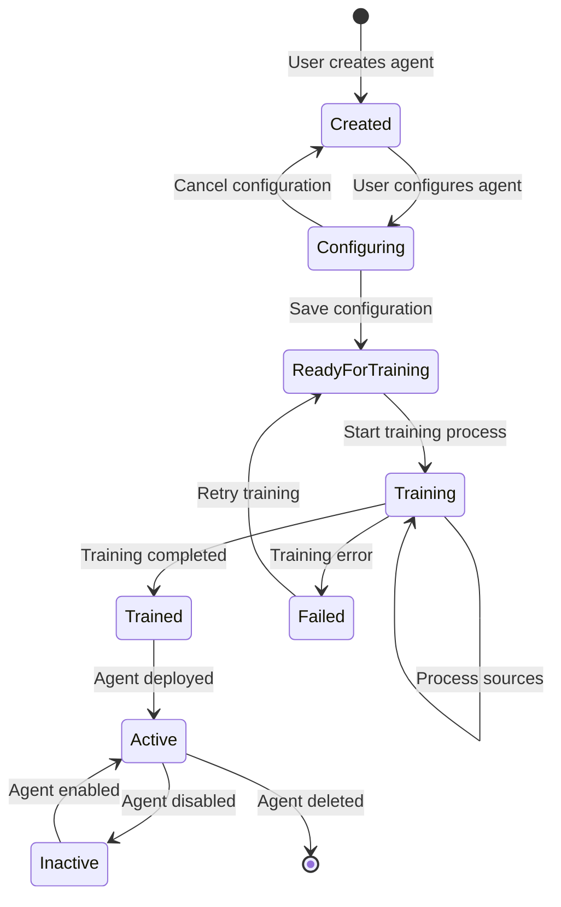
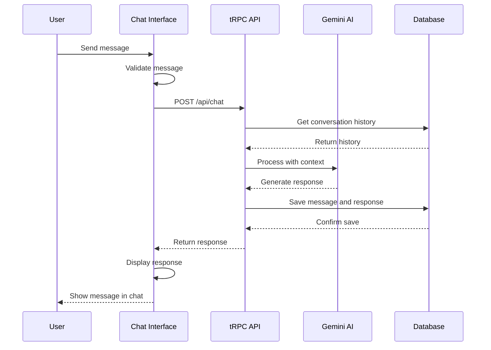
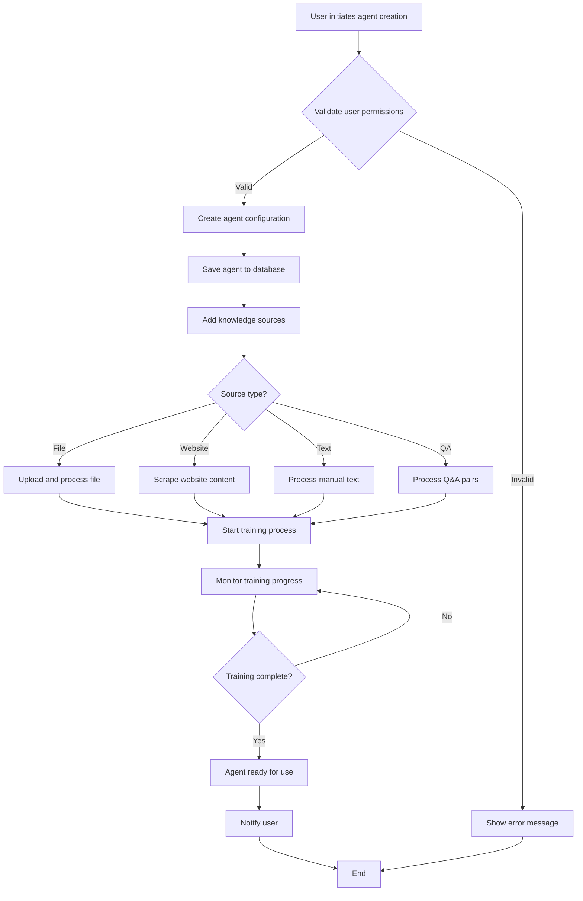

# Chapter 3: System Analysis

## 3.1 System Analysis

### 3.1.1 Requirement Analysis

#### Functional Requirements

The ChatBuddy AI chatbot system encompasses several core functional requirements that define the system's capabilities and user interactions:

**User Authentication and Management**
- Users must be able to register and authenticate using Supabase authentication
- Support for Google authentication provider

**Agent Creation and Management**
- Users can create custom AI agents with specific personalities and capabilities
- Agent configuration including name, description, and behavioral parameters
- Agent training with custom knowledge sources
- Agent sharing and deployment capabilities

**Knowledge Source Integration**
- File upload and processing (PDF, DOCX, TXT formats)
- Website content scraping and integration
- Manual text input for knowledge base creation
- Question-answer pair management

**Chat Interface and Communication**
- Real-time chat interface with AI agents
- Message history and conversation persistence
- Support for markdown formatting in responses

**Custom Actions and Integrations**
- API endpoint integration for external services
- Custom function creation and deployment
- E-commerce integration capabilities
- Third-party service connections

**Analytics and Monitoring**
- Agent performance metrics
- User activity monitoring
- Training progress tracking
- Error logging and debugging

**Embedding and Deployment**
- Embeddable chat widget generation
- Customizable chat interface themes

**Use Case Diagram**

#### Non-Functional Requirements

**Performance Requirements**
- Response time: Chat responses should be generated within 3-5 seconds
- Concurrent users: System should support at least 1000 concurrent users
- Scalability: Architecture should support horizontal scaling

**Usability Requirements**
- Intuitive user interface with modern design principles
- Cross-browser compatibility

**Reliability Requirements**
- Data backup and recovery procedures
- Fault tolerance for critical system components
- Error handling and graceful degradation
- Monitoring and alerting systems

### 3.1.2 Feasibility Analysis

#### Technical Feasibility

**Technology Stack Assessment**
The proposed technology stack is technically feasible and well-established:

- **Frontend**: Next.js 14 with React and TypeScript provides a robust, scalable foundation
- **Backend**: tRPC with Next.js API routes offers type-safe API development
- **Database**: Supabase (PostgreSQL) provides reliable data storage and real-time capabilities
- **AI Integration**: Gemini API integration is well-documented and stable
- **File Storage**: Supabase Storage provides scalable file management
- **Deployment**: Vercel offers seamless deployment and scaling

**Development Team Capabilities**
- Team has experience with React, TypeScript, and modern web development
- Familiarity with AI/ML concepts and API integration
- Understanding of database design and optimization
- Experience with cloud deployment and DevOps practices

**Infrastructure Requirements**
- Cloud hosting through Vercel and Supabase
- CDN for global content delivery
- Monitoring and logging infrastructure

#### Operational Feasibility

**User Acceptance**
- Growing demand for AI-powered chatbot solutions
- Familiar chat interface reduces learning curve
- Customizable agents meet diverse use case requirements
- Embeddable widgets enable easy integration

**Organizational Impact**
- Minimal disruption to existing workflows
- Gradual rollout and adoption strategy
- Comprehensive documentation and training materials
- Ongoing support and maintenance procedures

**Maintenance Requirements**
- Automated deployment and testing pipelines
- Performance monitoring and optimization
- User support and feedback systems

#### Economic Feasibility

**Development Costs**
- Development team salaries and overhead
- Cloud infrastructure costs (Vercel, Supabase, Gemini)
- Third-party service subscriptions
- Development tools and licenses

**Operational Costs**
- Monthly cloud hosting and storage fees
- API usage costs (OpenAI, external services)
- Maintenance and support personnel
- Marketing and user acquisition costs

**Revenue Projections**
- Freemium model with premium features
- Enterprise licensing for large organizations
- API usage-based pricing
- Custom development services

#### Schedule Feasibility

**Project Timeline**
The project follows a structured development approach with clear milestones:

**Phase 1: Foundation (Weeks 1-4)**
- Project setup and environment configuration
- Basic authentication and user management
- Core database schema design
- Initial UI/UX development

**Phase 2: Core Features (Weeks 5-8)**
- Agent creation and management system
- Basic chat interface implementation
- File upload and processing capabilities
- Knowledge source integration

**Phase 3: Advanced Features (Weeks 9-12)**
- Custom actions and API integrations
- Advanced chat features (markdown, code execution)
- Analytics and monitoring dashboard
- Embedding and deployment capabilities

**Phase 4: Testing and Optimization (Weeks 13-14)**
- Comprehensive testing and bug fixes
- Performance optimization
- Security audit and compliance
- Documentation and deployment preparation

**Phase 5: Launch and Maintenance (Weeks 15-16)**
- Production deployment
- User feedback collection
- Continuous improvement and updates
- Support and maintenance procedures

**Risk Mitigation**
- Parallel development tracks for independent components
- Regular code reviews and testing
- Agile development methodology with sprints
- Backup plans for critical dependencies

### 3.1.3 Analysis

#### Object-Oriented Analysis

**Class Diagram Analysis**

The system follows an object-oriented approach with the following key classes:

**User Class**
- Properties: id, email, name, avatar_url, created_at
- Methods: authenticate(), updateProfile(), getAgents()
- Relationships: One-to-Many with Agent, One-to-Many with ChatSession

**Agent Class**
- Properties: id, name, description, system_prompt, user_id, created_at
- Methods: train(), chat(), updateSettings(), delete()
- Relationships: Many-to-One with User, One-to-Many with Source, One-to-Many with ChatSession

**Source Class**
- Properties: id, name, type, content, agent_id, created_at
- Methods: process(), validate(), update()
- Relationships: Many-to-One with Agent

**ChatSession Class**
- Properties: id, agent_id, user_id, created_at, updated_at
- Methods: addMessage(), getHistory(), clear()
- Relationships: Many-to-One with Agent, Many-to-One with User, One-to-Many with Message

**Message Class**
- Properties: id, session_id, role, content, created_at
- Methods: format(), validate()
- Relationships: Many-to-One with ChatSession

**CustomAction Class**
- Properties: id, name, description, endpoint_url, agent_id, created_at
- Methods: execute(), validate(), update()
- Relationships: Many-to-One with Agent

**Class Diagram**

#### Dynamic Modeling

**State Diagram for Agent Training**

The agent training process follows a state machine pattern:

1. **Initial State**: Agent created but not trained
2. **Processing State**: Training in progress with sources
3. **Trained State**: Agent ready for chat interactions

**State Diagram**

**Sequence Diagram for Chat Interaction**

The chat interaction flow involves multiple system components:

1. User sends message to chat interface
2. Frontend validates and formats message
3. Message sent to tRPC API endpoint
4. Backend processes message through AI service
5. Response generated and returned to frontend
6. Message displayed in chat interface
7. Conversation history updated in database

**Sequence Diagram**

**Activity Diagram for Agent Creation**

The agent creation process involves several parallel activities:

1. User initiates agent creation
2. System validates user permissions
3. Agent configuration saved to database
4. Knowledge sources processed in parallel
5. Agent training initiated
6. Training progress monitored
7. Agent becomes available for use

**Activity Diagram**

#### Process Modeling

**Use Case Analysis**

**Primary Use Cases:**

1. **User Registration and Authentication**
   - Actor: New User
   - Goal: Create account and access system
   - Preconditions: Valid email address
   - Postconditions: User logged in and can access dashboard

2. **Agent Creation**
   - Actor: Authenticated User
   - Goal: Create custom AI agent
   - Preconditions: User has valid subscription
   - Postconditions: Agent created and ready for training

3. **Knowledge Source Addition**
   - Actor: Agent Owner
   - Goal: Add training data to agent
   - Preconditions: Agent exists and user has permissions
   - Postconditions: Source processed and agent knowledge updated

4. **Chat Interaction**
   - Actor: User
   - Goal: Communicate with AI agent
   - Preconditions: Agent is trained and available
   - Postconditions: Response generated and conversation updated

5. **Custom Action Integration**
   - Actor: Agent Owner
   - Goal: Connect external services to agent
   - Preconditions: Valid API endpoint and authentication
   - Postconditions: Action available for agent use

**Data Flow Analysis**

The system processes data through several key flows:

1. **User Authentication Flow**
   - Input: Google OAuth credentials
   - Process: Supabase authentication

2. **File Processing Flow**
   - Input: Uploaded files
   - Process: Text extraction and chunking
   - Output: Processed knowledge base

3. **Chat Processing Flow**
   - Input: User message
   - Process: AI model processing with context
   - Output: Generated response

This comprehensive system analysis provides the foundation for the detailed design phase, ensuring that all requirements are properly understood and the system architecture is well-defined before implementation begins. 