# Chapter 4: System Design

## 4.1 Design

### 4.1.1 Object-Oriented Design

#### Entity-Relationship (ER) Diagrams

The system design is represented through comprehensive ER diagrams showing the database structure and relationships:

**Main Database Schema ER Diagram**

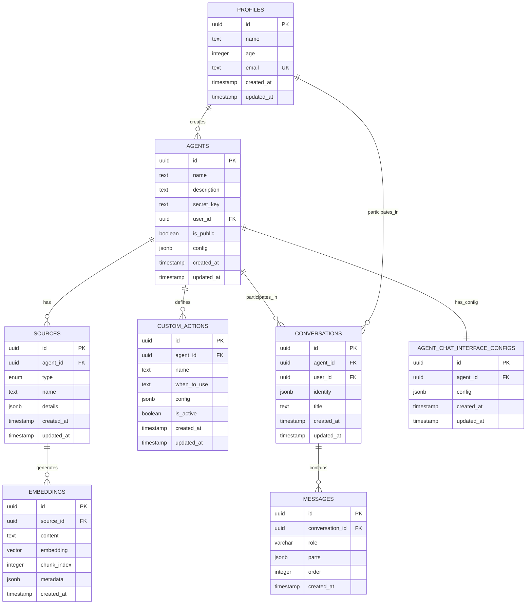

#### Sequence Diagrams

**Agent Creation and Configuration Sequence**

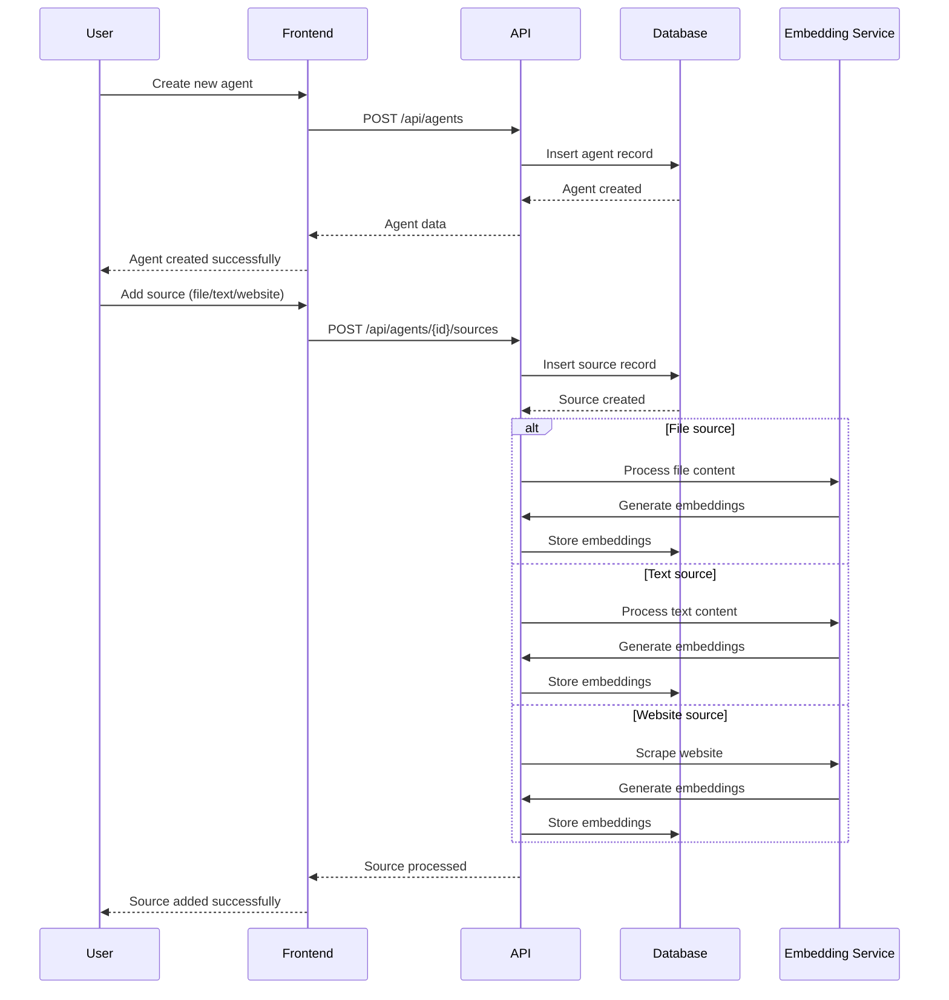

**Chat Conversation Sequence**

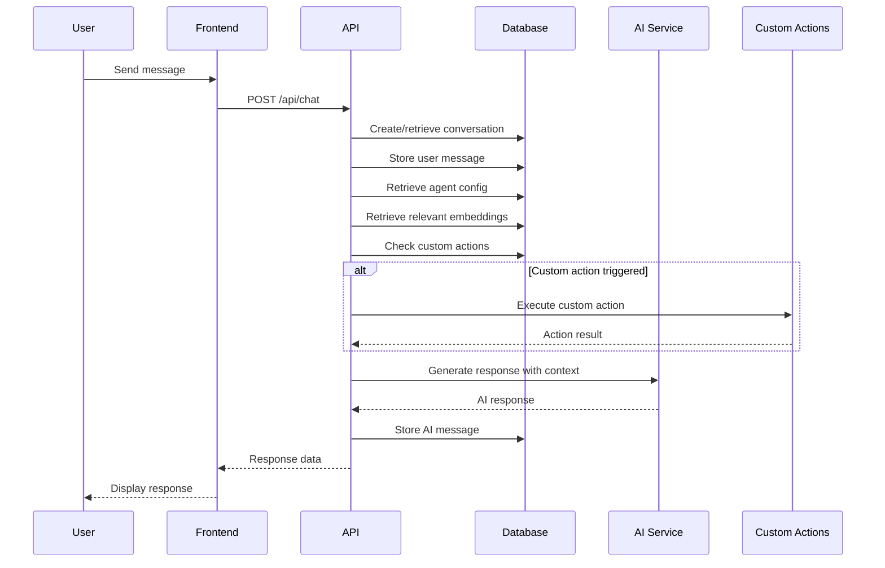

**Agent Training and Embedding Generation**

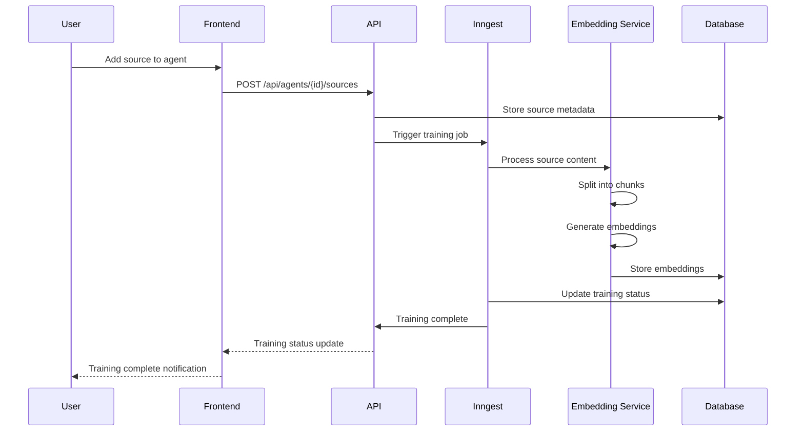

### 4.1.2 Component Diagrams

**System Architecture Components**

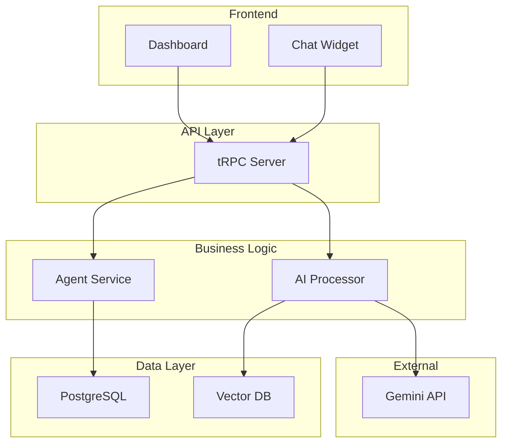

### 4.1.3 Deployment Diagrams

**Production Deployment Architecture**

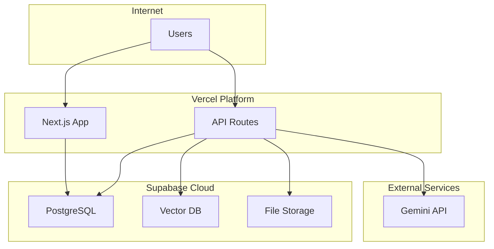

## 4.2 Algorithm Details

### 4.2.1 Agent Training and Knowledge Processing Workflow

**Complete Training Pipeline**

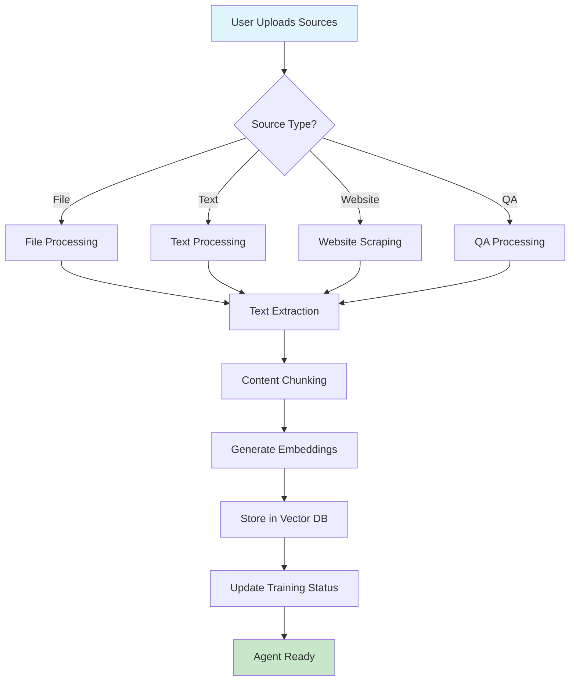

### 4.2.2 Chat Response Generation Workflow

**Intelligent Response Pipeline**

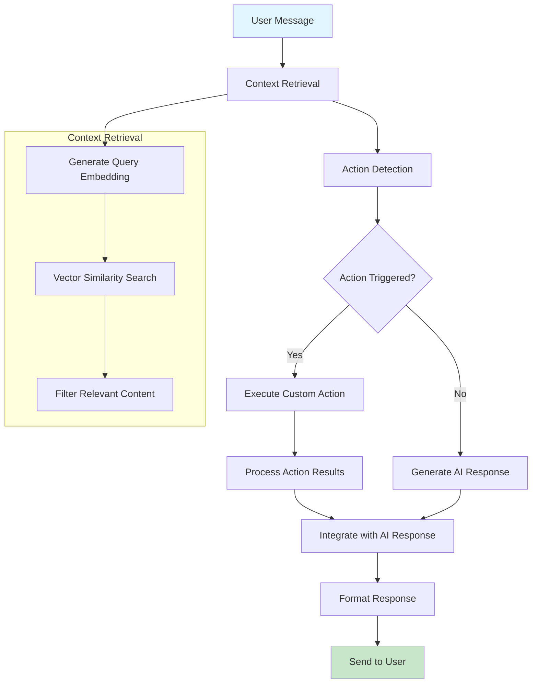

### 4.2.3 Custom Action Execution Workflow

**Dynamic API Integration**

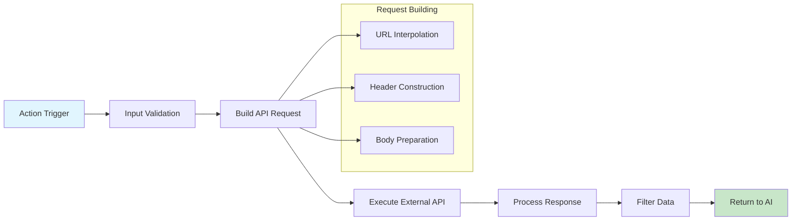

### 4.2.4 Vector Search and Context Retrieval

**Semantic Search Process**

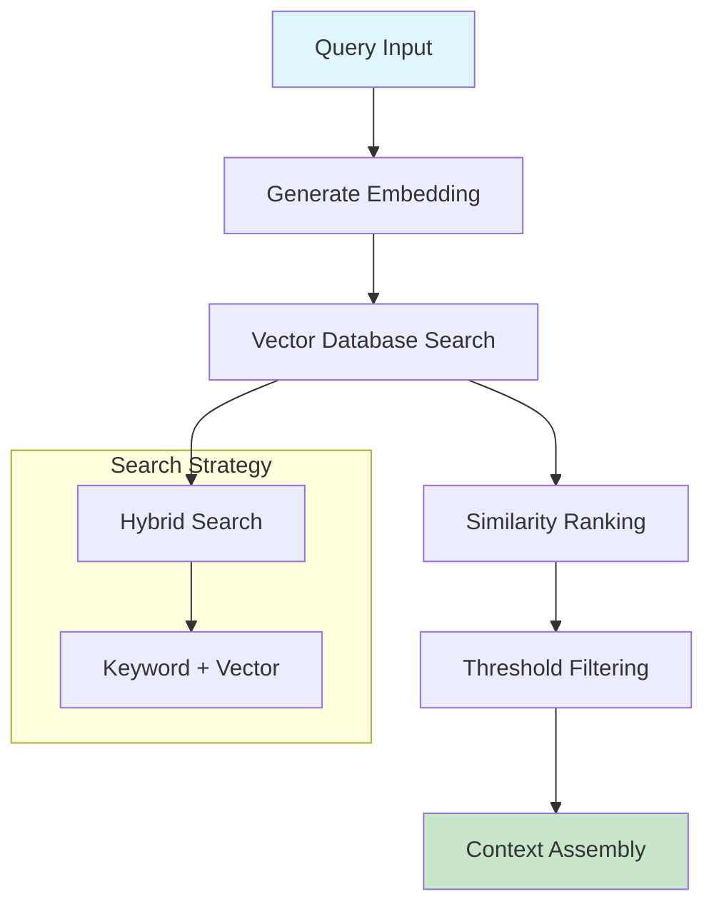

### 4.2.5 Content Processing and Embedding Generation

**Text Processing Pipeline**

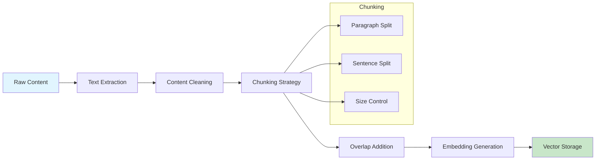

These workflow diagrams illustrate the core algorithmic processes that power the ChatBuddy AI chatbot system, showing how multiple algorithms work together to enable key features like intelligent training, context-aware responses, and dynamic action execution. 