# Chapter 4: System Design

## 4.1 Design

### 4.1.1 Object-Oriented Design

#### Entity-Relationship (ER) Diagrams

The system design is represented through comprehensive ER diagrams showing the database structure and relationships:

**Main Database Schema ER Diagram**

```mermaid
erDiagram
    PROFILES {
        uuid id PK
        text name
        integer age
        text email UK
        timestamp created_at
        timestamp updated_at
    }
    
    AGENTS {
        uuid id PK
        text name
        text description
        text secret_key
        uuid user_id FK
        boolean is_public
        jsonb config
        timestamp created_at
        timestamp updated_at
    }
    
    SOURCES {
        uuid id PK
        uuid agent_id FK
        enum type
        text name
        jsonb details
        timestamp created_at
        timestamp updated_at
    }
    
    EMBEDDINGS {
        uuid id PK
        uuid source_id FK
        text content
        vector embedding
        integer chunk_index
        jsonb metadata
        timestamp created_at
    }
    
    CUSTOM_ACTIONS {
        uuid id PK
        uuid agent_id FK
        text name
        text when_to_use
        jsonb config
        boolean is_active
        timestamp created_at
        timestamp updated_at
    }
    
    CONVERSATIONS {
        uuid id PK
        uuid agent_id FK
        uuid user_id FK
        jsonb identity
        text title
        timestamp created_at
        timestamp updated_at
    }
    
    MESSAGES {
        uuid id PK
        uuid conversation_id FK
        varchar role
        jsonb parts
        integer order
        timestamp created_at
    }
    
    AGENT_CHAT_INTERFACE_CONFIGS {
        uuid id PK
        uuid agent_id FK UK
        jsonb config
        timestamp created_at
        timestamp updated_at
    }
    
    PROFILES ||--o{ AGENTS : "creates"
    AGENTS ||--o{ SOURCES : "has"
    SOURCES ||--o{ EMBEDDINGS : "generates"
    AGENTS ||--o{ CUSTOM_ACTIONS : "defines"
    AGENTS ||--o{ CONVERSATIONS : "participates_in"
    PROFILES ||--o{ CONVERSATIONS : "participates_in"
    CONVERSATIONS ||--o{ MESSAGES : "contains"
    AGENTS ||--|| AGENT_CHAT_INTERFACE_CONFIGS : "has_config"
```

**Source Types and Details ER Diagram**

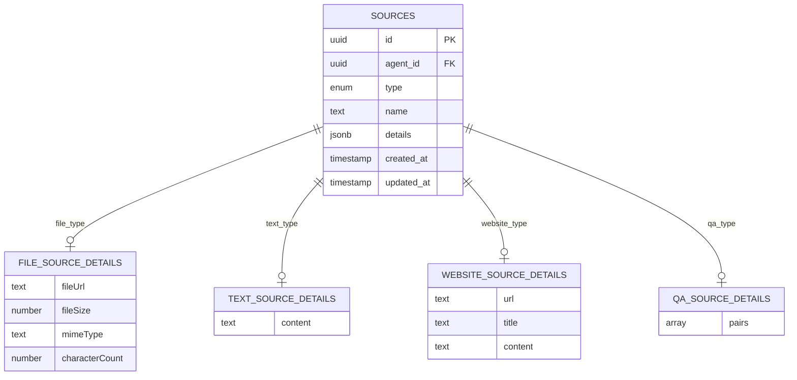

**Custom Action Configuration ER Diagram**

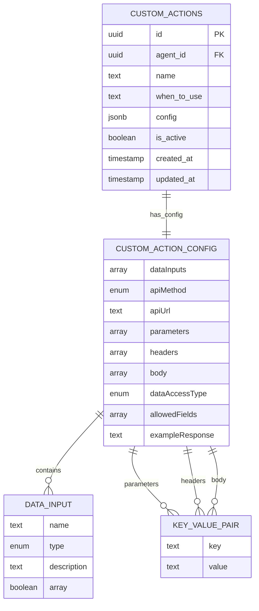

**Agent Configuration and Chat Interface ER Diagram**

```mermaid
erDiagram
    AGENTS {
        uuid id PK
        text name
        text description
        text secret_key
        uuid user_id FK
        boolean is_public
        jsonb config
        timestamp created_at
        timestamp updated_at
    }
    
    AGENT_CONFIG {
        number temperature
        text model
        text systemPrompt
    }
    
    AGENT_CHAT_INTERFACE_CONFIGS {
        uuid id PK
        uuid agent_id FK UK
        jsonb config
        timestamp created_at
        timestamp updated_at
    }
    
    CHAT_INTERFACE_CONFIG {
        text displayName
        text profilePicture
        text chatBubbleTriggerIcon
        text userMessageColor
        boolean syncUserMessageColorWithAgentHeader
        text chatBubbleButtonColor
        text initialMessages
        array suggestedMessages
        text messagePlaceholder
        text footer
        text dismissibleNotice
    }
    
    AGENTS ||--|| AGENT_CONFIG : "has_config"
    AGENTS ||--|| AGENT_CHAT_INTERFACE_CONFIGS : "has_interface"
    AGENT_CHAT_INTERFACE_CONFIGS ||--|| CHAT_INTERFACE_CONFIG : "contains"
```

**Conversation and Message Flow ER Diagram**

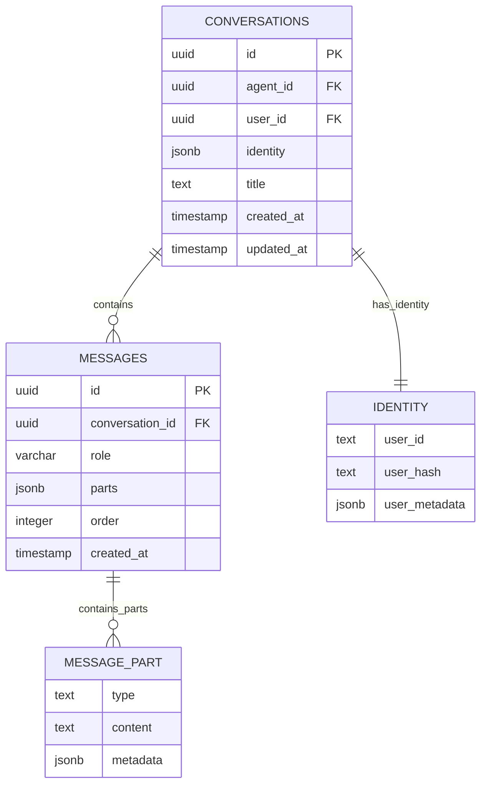

#### Sequence Diagrams

**Agent Creation and Training Sequence**
```
User -> Frontend: Create Agent
Frontend -> tRPC: createAgent(agentData)
tRPC -> Database: Insert Agent
Database -> tRPC: Agent Created
tRPC -> Frontend: Agent Response
Frontend -> User: Agent Created

User -> Frontend: Add Sources
Frontend -> tRPC: addSource(sourceData)
tRPC -> FileProcessor: Process Files
FileProcessor -> TextSplitter: Split Content
TextSplitter -> EmbeddingService: Generate Embeddings
EmbeddingService -> Database: Store Embeddings
tRPC -> Frontend: Sources Added
Frontend -> User: Training Complete
```

**Chat Interaction Sequence**
```
User -> ChatInterface: Send Message
ChatInterface -> tRPC: sendMessage(message)
tRPC -> ConversationService: Add Message
ConversationService -> Database: Store Message
tRPC -> AIProcessor: Process with Context
AIProcessor -> EmbeddingService: Find Relevant Context
EmbeddingService -> Database: Query Embeddings
AIProcessor -> GeminiAPI: Generate Response
GeminiAPI -> AIProcessor: Response
AIProcessor -> tRPC: Formatted Response
tRPC -> ConversationService: Add AI Message
ConversationService -> Database: Store AI Message
tRPC -> ChatInterface: Response
ChatInterface -> User: Display Response
```

#### Activity Diagrams

**Agent Creation Workflow**
```
[Start] -> [User Authentication]
[User Authentication] -> [Agent Configuration]
[Agent Configuration] -> [Source Addition]
[Source Addition] -> [File Processing] (Parallel)
[Source Addition] -> [Text Processing] (Parallel)
[Source Addition] -> [Website Scraping] (Parallel)
[File Processing] -> [Text Extraction]
[Text Extraction] -> [Content Chunking]
[Content Chunking] -> [Embedding Generation]
[Embedding Generation] -> [Database Storage]
[Database Storage] -> [Training Completion]
[Training Completion] -> [Agent Ready]
[Agent Ready] -> [End]
```

**Custom Action Execution Workflow**
```
[Start] -> [Action Trigger]
[Action Trigger] -> [Input Validation]
[Input Validation] -> [API Request Preparation]
[API Request Preparation] -> [External API Call]
[External API Call] -> [Response Processing]
[Response Processing] -> [Data Filtering] (if limited access)
[Data Filtering] -> [Response Formatting]
[Response Formatting] -> [AI Integration]
[AI Integration] -> [End]
```

### 4.1.2 Component Diagrams

**System Architecture Components**

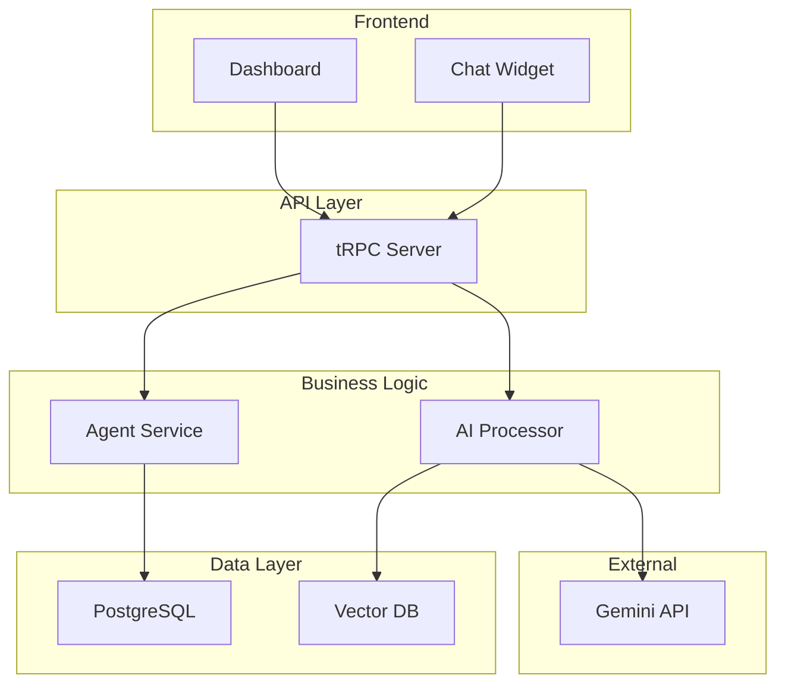

**Agent Component Architecture**

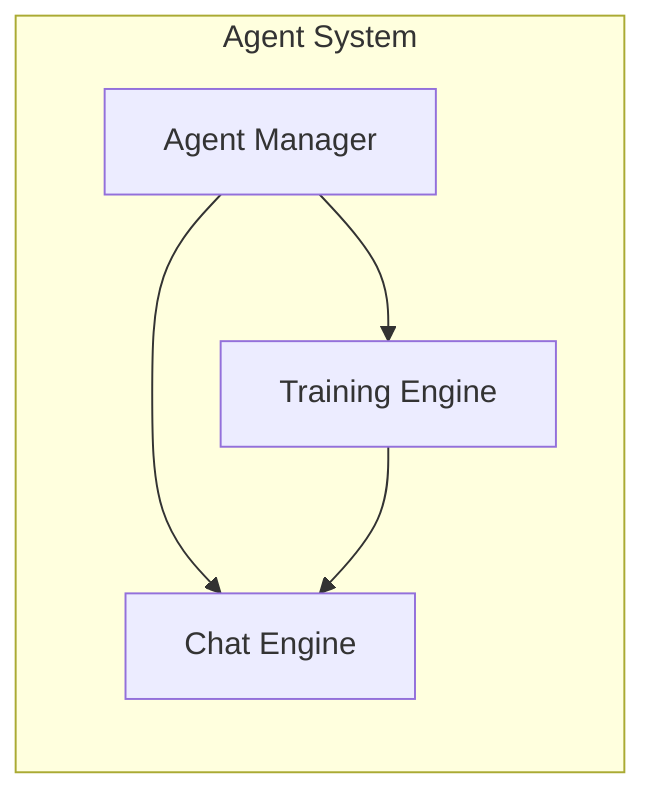

### 4.1.3 Deployment Diagrams

**Production Deployment Architecture**

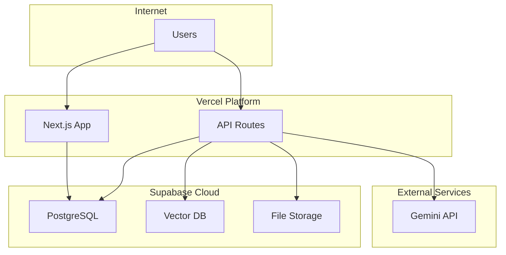

**Development Environment**

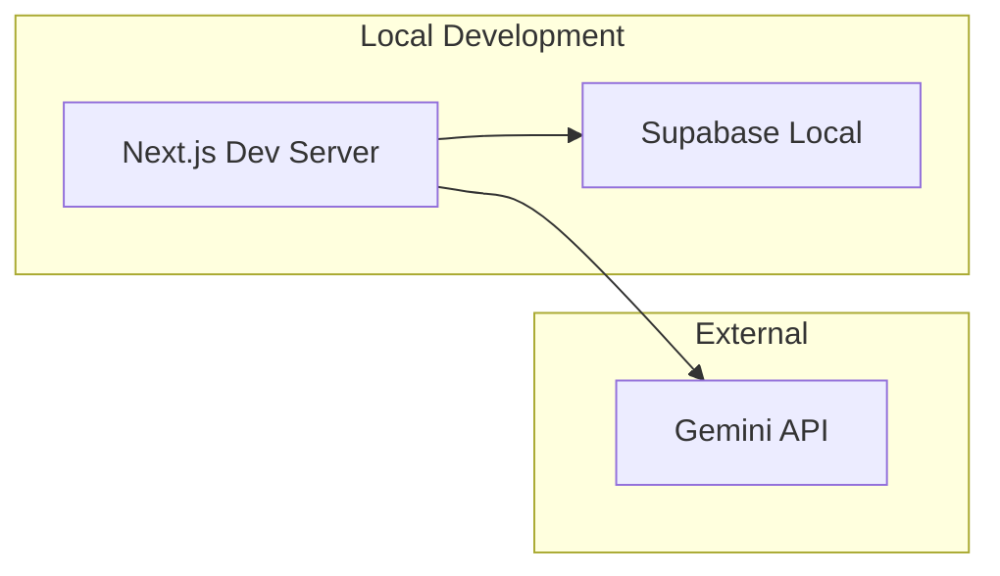

## 4.2 Algorithm Details

### 4.2.1 Agent Training and Knowledge Processing Workflow

**Complete Training Pipeline**

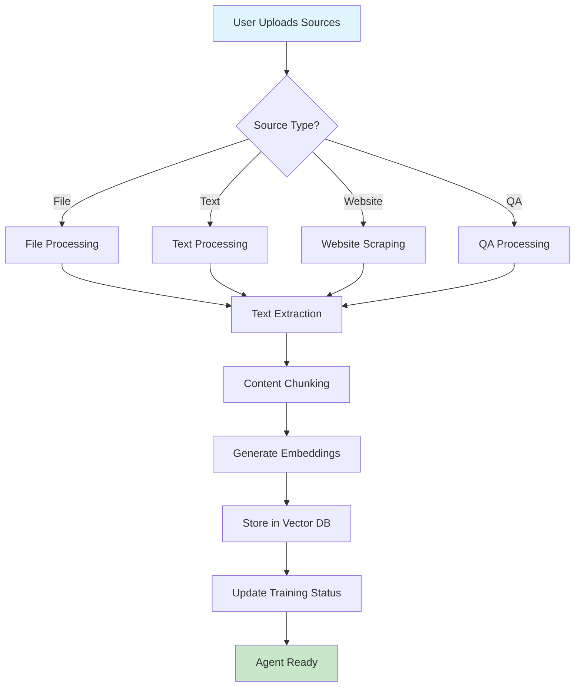

### 4.2.2 Chat Response Generation Workflow

**Intelligent Response Pipeline**

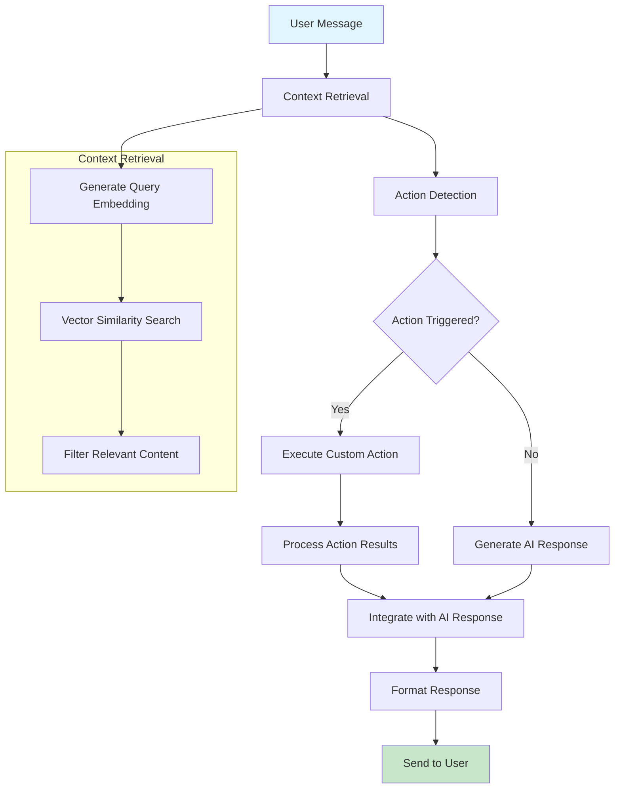

### 4.2.3 Custom Action Execution Workflow

**Dynamic API Integration**

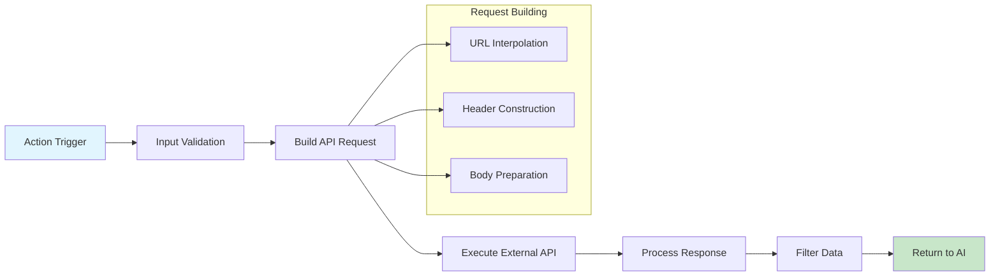

### 4.2.4 Vector Search and Context Retrieval

**Semantic Search Process**

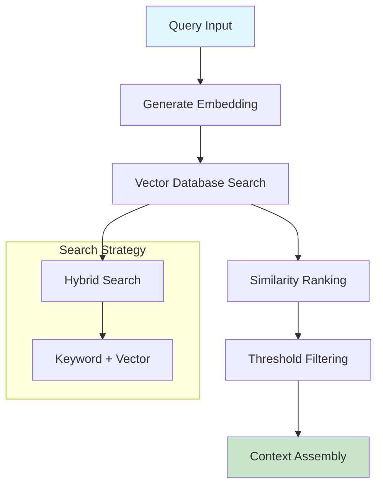

### 4.2.5 Content Processing and Embedding Generation

**Text Processing Pipeline**

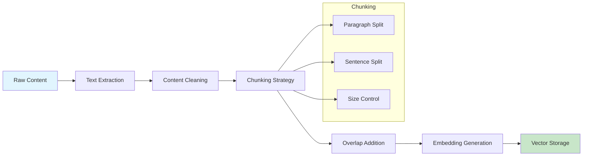

These workflow diagrams illustrate the core algorithmic processes that power the ChatBuddy AI chatbot system, showing how multiple algorithms work together to enable key features like intelligent training, context-aware responses, and dynamic action execution. 